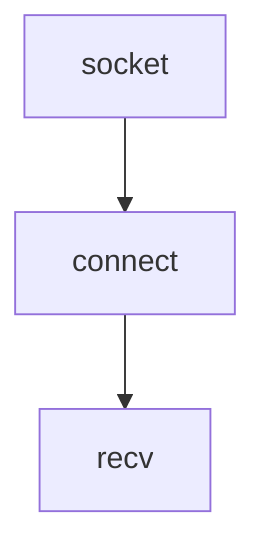

# What are sockets?

* Sockets are the low level endpoint used for processing information across a network.

* Common networking protocols like HTTP, and FTP rely on sockets underneath to make connections.

# Client socket workflow

The client socket is created with a **socket** call, and connected to a remote address with the **connect** call, and then finally can retrieve data with the **recv** call.

